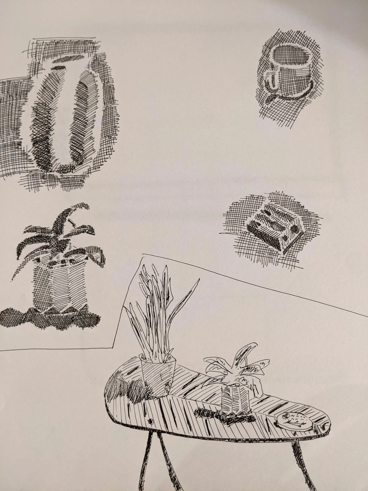

# Art

## Machine - 180 Strand

## Walter Richard Sickert

[Who is this artist?](https://whoisthisartist.netlify.app/gallery/walter-richard-sickert)

## Zadok Ben-David

[Who is this artist?](https://whoisthisartist.netlify.app/gallery/zadok-ben-david)

## Shilpa Gupta

[Who is this artist?](https://whoisthisartist.netlify.app/gallery/shilpa-gupta)

## Isamu Noguchi

[Who is this artist?](https://whoisthisartist.netlify.app/gallery/isamu-noguchi)

## Tiger

## Staring - City Of London

## Speakers

## Ducks

## Plant

## Links to this note

[Who am I?](index.md)
