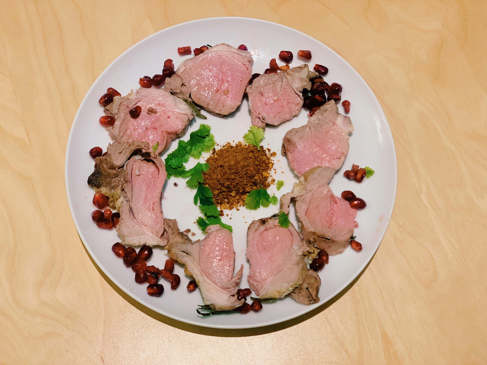
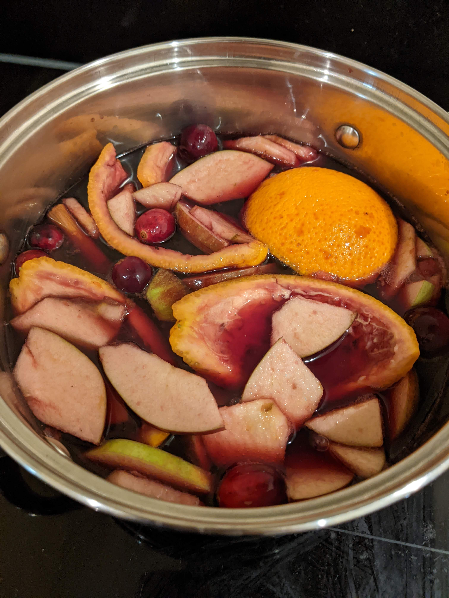
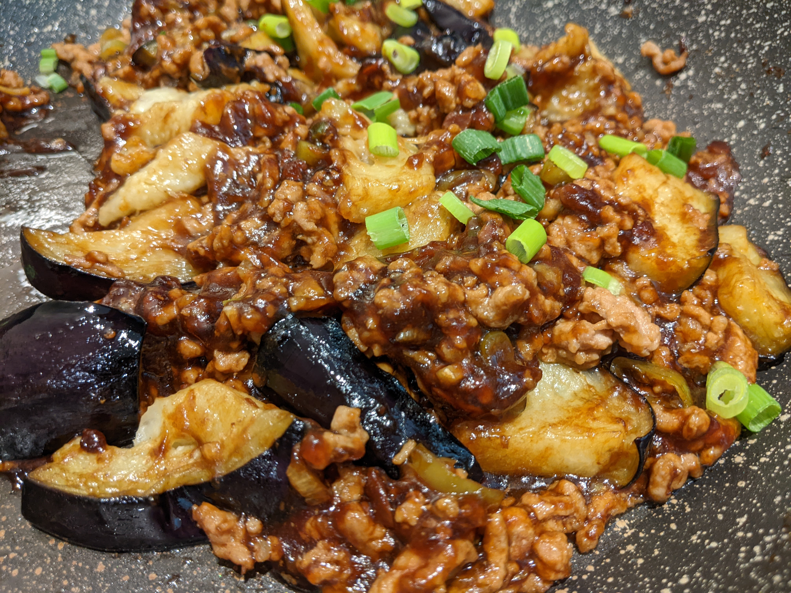
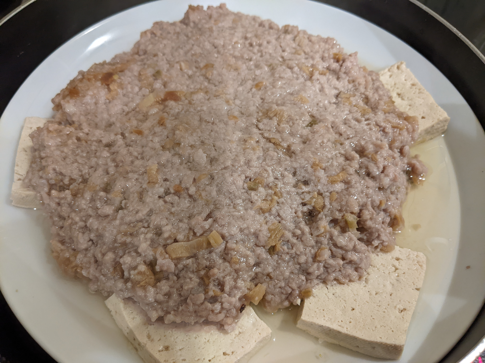
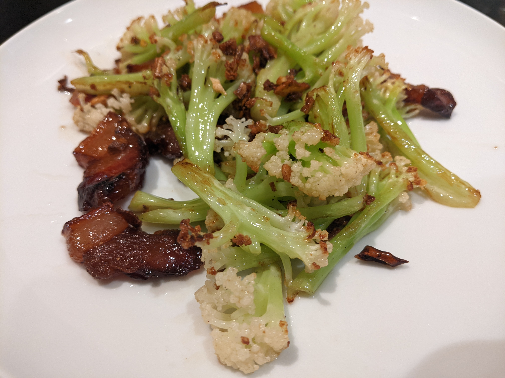
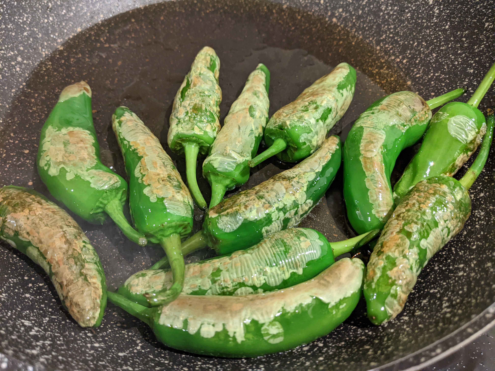

# Cooking

I love to cook! I can cook the following dishes.

## New Year Meals

## Mulled Wine

## 鱼香茄子

[recipe](https://www.xiachufang.com/recipe/104416071/)

## 梅菜蒸肉饼

## 干锅花菜

## 西班牙小辣椒 - Padrón Peppers

## 蜜汁叉烧

Ginger's drawing

## 番茄炒蛋

## 剁椒鱼柳

## fry chicken

## homemade chips

## 老火汤

## 土豆闷鸭

## burger

## 西班牙小辣椒

## japanese and Indian Curry

## 小白菜汤

## 炒米粉

## 韩国拌饭

## 拌米粉

## pasta

## 皮蛋瘦肉粥

## 珍珠奶茶

## 爆炒花甲

## 干煸豆角肉末

## 干锅腊肉白菜
## Links to this note

[Who am I?](index.md)

