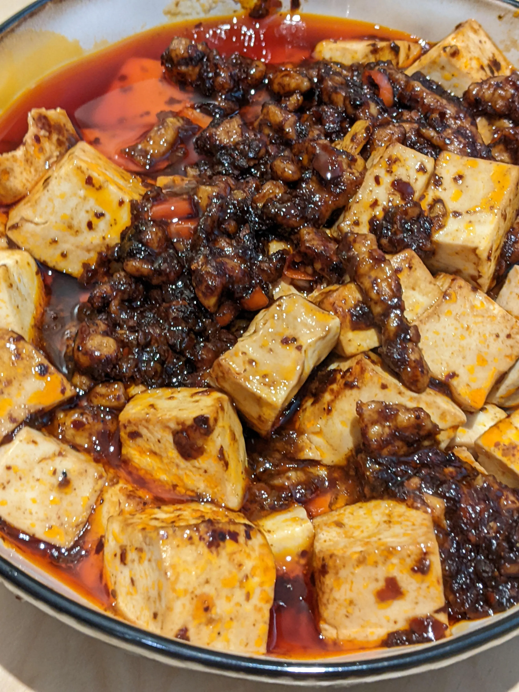
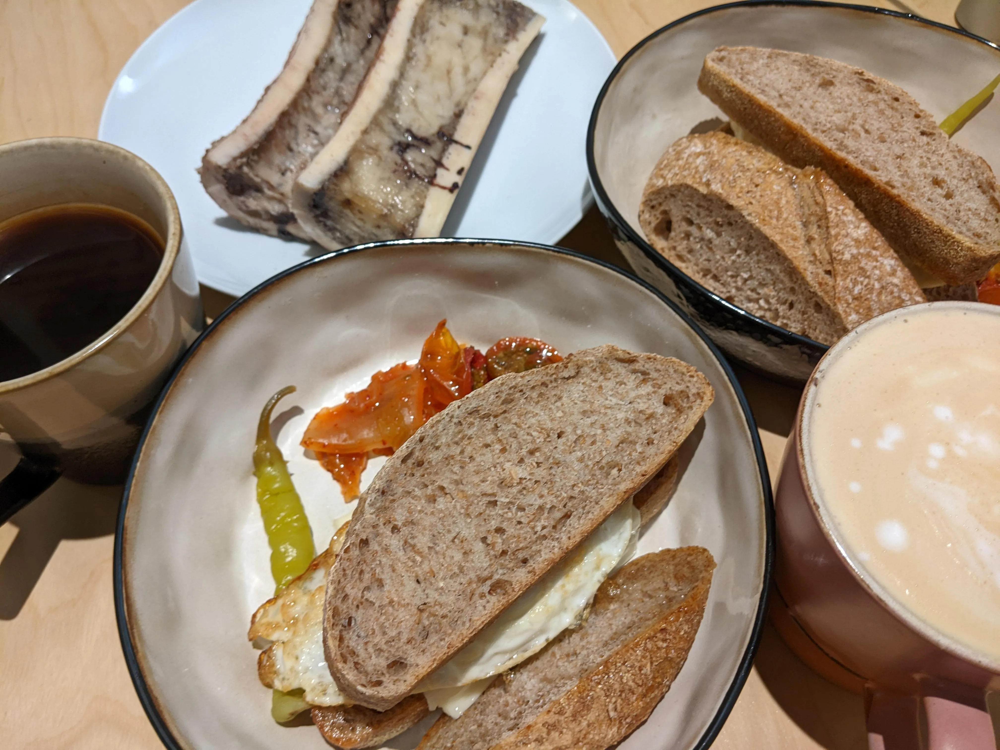
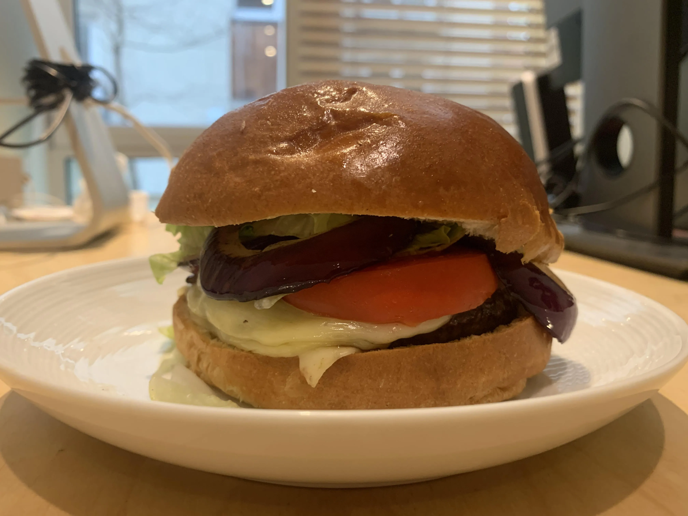
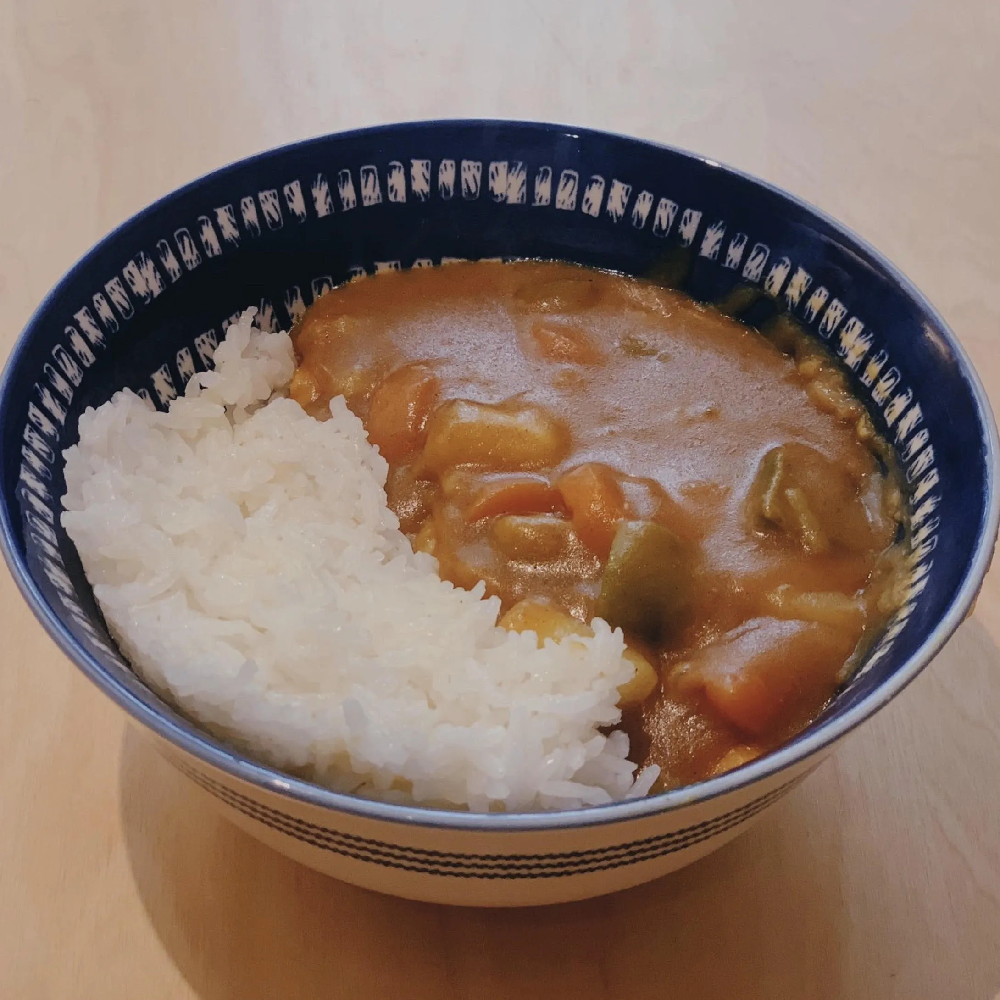
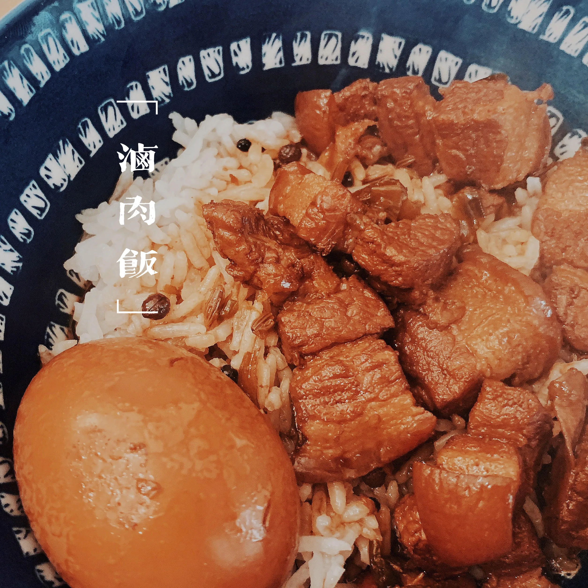

# Cooking

I love to cook! I can cook the following dishes.

## Sicuan Chili Chicken - 钵钵鸡

{ loading=lazy }

## Sicuan Chili Tofu - 麻婆豆腐

{ loading=lazy }

## Fermented Bean Curd With Morning Glory - 腐乳通菜心

{ loading=lazy }

## Steam Fish With Chopped Chili - 剁椒鱼柳

{ loading=lazy }

## Bibimbap - 韩国拌饭

{ loading=lazy }

## Chicken Wing With Coca Cola Curry - 可乐鸡翅

{ loading=lazy }

## Cantonese Steamed Fish - 广式蒸鱼

{ loading=lazy }

## 干煸豆角肉末

[recipe](how-to-cook-stir-fry-beans-with-mince.md)

{ loading=lazy }

## Breakfast

{ loading=lazy }

{ loading=lazy }

{ loading=lazy }

{ loading=lazy }

## New Year Meals

{ loading=lazy }

{ loading=lazy }

## Mulled Wine

[recipe](how-to-make-mulled-wine.md)

{ loading=lazy }

## 鱼香茄子

[recipe](https://www.xiachufang.com/recipe/104416071/)

{ loading=lazy }

## 梅菜蒸肉饼

{ loading=lazy }

## 干锅花菜

{ loading=lazy }

## 西班牙小辣椒 - Padrón Peppers

{ loading=lazy }

## Char Siew with Honey Sause - 蜜汁叉烧

{ loading=lazy }

Ginger's drawing

{ loading=lazy }

## 酸菜鱼 - Sour Pickled Mustard With Fish

[Recipe](how-to-make-sour-pickled-mustard-fish.md)

{ loading=lazy }

## 土豆闷鸭 - Potato with Duck

[Recipe](how-to-make-duck-and-potato-curry.md)

{ loading=lazy }

## 炒米粉

{ loading=lazy }

## Tomato With Egg - 番茄炒蛋

{ loading=lazy }

## Homemade Fry Chicken and Chips

{ loading=lazy }

## Burger

{ loading=lazy }

## Fried Clams - 爆炒花甲

{ loading=lazy }

## Fish Soup - 鱼汤

{ loading=lazy }

## Pho

{ loading=lazy }

## Dumplings

{ loading=lazy }

## Pizza

{ loading=lazy }

## Koushui Chicken - 口水鸡

{ loading=lazy }

## Beer Chicken - 啤酒鸡

{ loading=lazy }

## Japanese Curry

{ loading=lazy }

## Pork With Red Beans Soup

{ loading=lazy }

## Braised Pork Rice - 卤肉饭

{ loading=lazy }

## Squid Ink Pasta

{ loading=lazy }

## Indian Curry

## 小白菜汤

## 拌米粉

## 皮蛋瘦肉粥

## 珍珠奶茶

## 干锅腊肉白菜

## Links to this note

[Who am I?](index.md)
