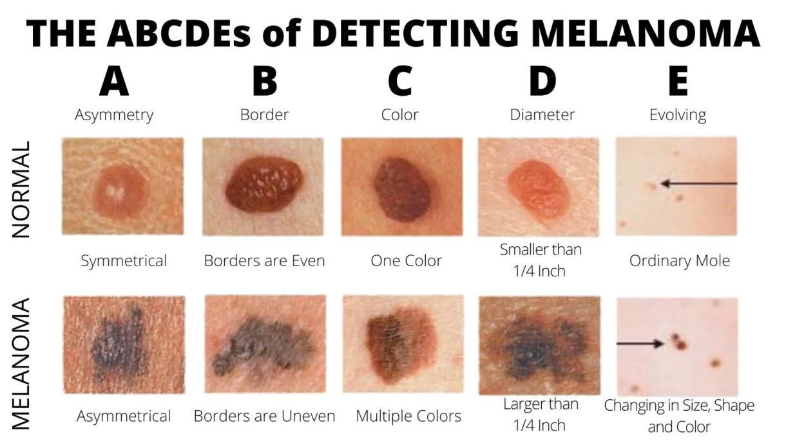

# How To Detect Cancerous Moles

Taken from [link](https://www.aimatmelanoma.org/melanoma-101/understanding-melanoma/moles-and-other-lesions/)

Reminder: If I notice changes in a mole or a new mole, contact my dermatologist for a skin evaluation.

