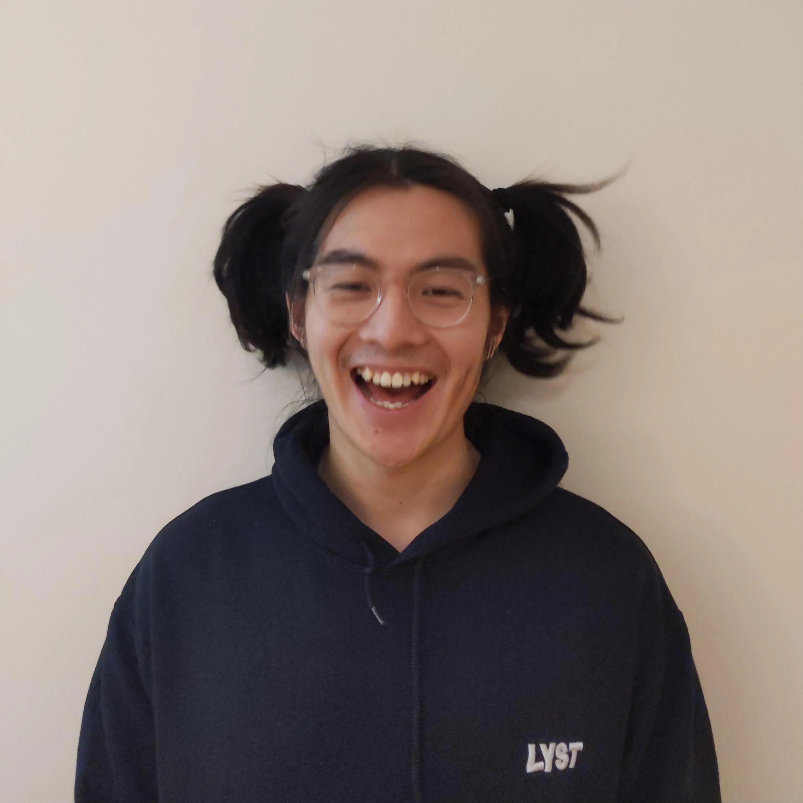

# Who am I?

My name is Tiger Yuhao Huang.

{ width="350" }

Welcome to my [digital garden](digital-garden.md)!

I am a backend engineer at [Lyst](https://www.lyst.com).

I consider myself a [minimalist](minimalism.md), [see my possessions](all-things.md).

I love brewing and tasting [coffee](index-coffee.md).

I enjoy [cooking](cooking.md) and washing dishes :)

I am also interested in
[music](index-music.md),
[art](art.md),
[boardgames](boardgame.md),
[coding](https://github.com/ynotstartups),
[personal finance](https://www.bilibili.com/video/BV1u54y1x7zF),
[public speaking](https://www.bilibili.com/video/BV1u54y1x7zF),
[books](reading.md),
[writing](digital-garden.md),
video games,
...

My wildest dream is to become [a stand-up comedian](stand-up-comedy.md), a [farmer/gardener](farmer.md) to grow my own food or [an artist](artist.md).

Ginger and I had made some videos, see our [youtube channel](https://www.youtube.com/channel/UCQE6i7tcSbBQMD8KSeUQYvQ) and [bilibili channel](https://space.bilibili.com/1281157300).

## What am I doing now?

See [here](reminders.md)!

## Meaning Of Life

I believe that the meaning of life is to be alive.

I once thought the meaning of life is to enjoy every moment of life, but I don't think it is true any more because there were good days and bad days so it wasn't always possible to enjoy it.

But being alive (please do try your best) let you experience life in both its beauty and the ugly. Life is your unique experience with the world and every choices you made.

Others also believe in this idea.

> The meaning of life is just to be alive. It is so plain and so obvious and so simple. And yet, everybody rushes around in a great panic as if it were necessary to achieve something beyond themselves.
> ---- Alan Wilson Watts
