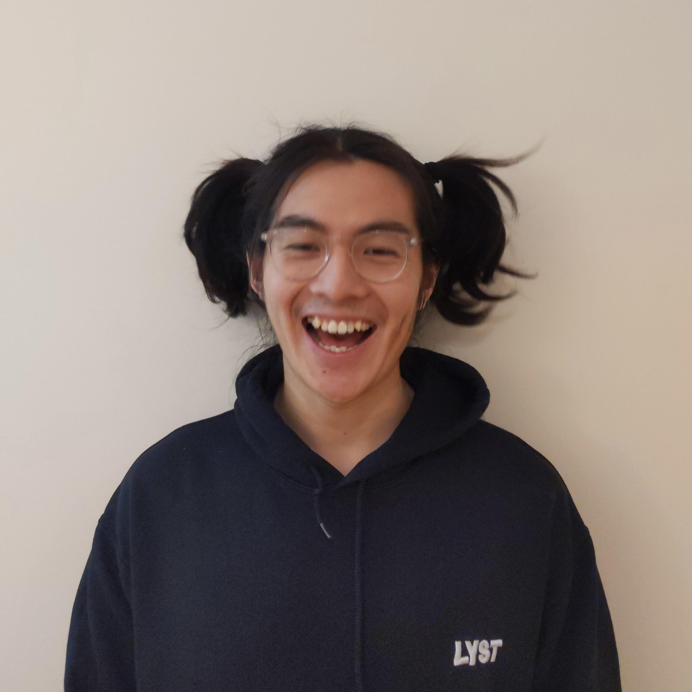

# Who am I?

My name is Tiger Yuhao Huang.

{ width="350" }

I am a backend engineering at [Lyst](https://www.lyst.com).

In my personal life, I am interested in [coffee](index-coffee.md), [non alcoholic beer](non-alcoholic-beer.md), [public speaking](https://www.bilibili.com/video/BV1u54y1x7zF), [minimalism](minimalism.md), [personal finance](https://www.bilibili.com/video/BV1u54y1x7zF), [art](art.md), [reading](reading.md), writing, [coding](https://github.com/ynotstartups), [meaning of life](#meaning-of-life), games, [boardgames](boardgame.md), [home cooking](cooking.md) ... 

Ginger and I have even made some videos, see our [youtube channel](https://www.youtube.com/channel/UCQE6i7tcSbBQMD8KSeUQYvQ) and [bilibili channel](https://space.bilibili.com/1281157300).

I created some 3D tools in my previous job, see [mesh simplification tool](https://myminifactory.github.io/Fast-Quadric-Mesh-Simplification/) and [stl to glb converter](https://myminifactory.github.io/stl2gltf/).

## Meaning Of Life

I believe that the meaning of life is just to be alive.

I once thought the meaning of life is to enjoy every moment of life, but I don't think it is true any more because there were good days and bad days so it wasn't always possible to enjoy it.

But being alive (please do try your best) let you experience life in both its beauty and the ugly. Life is your unique experience with the world and every choices you made.

Others also believe in this idea.

> The meaning of life is just to be alive. It is so plain and so obvious and so simple. And yet, everybody rushes around in a great panic as if it were necessary to achieve something beyond themselves.
> ---- Alan Wilson Watts
