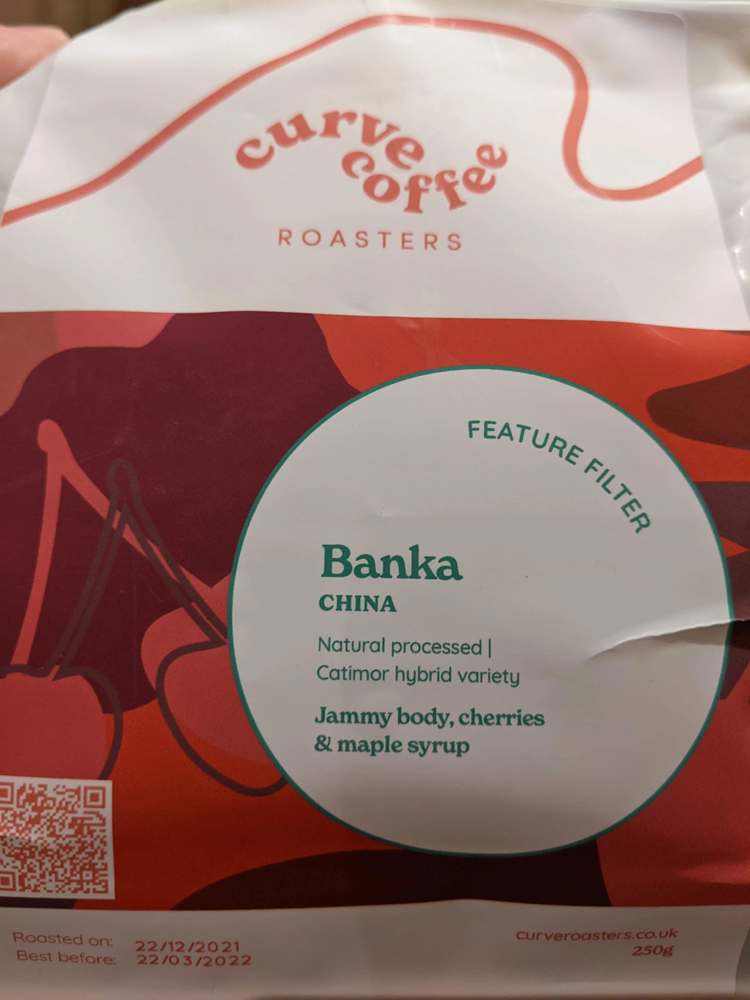
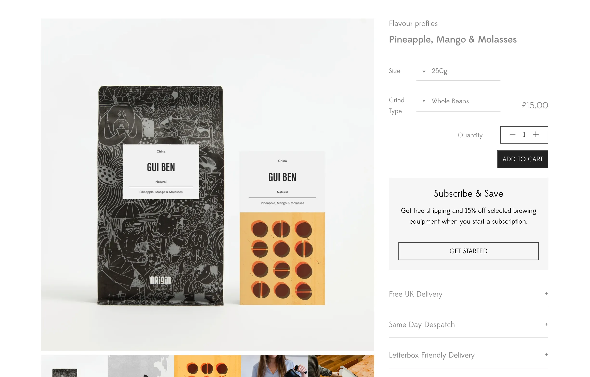
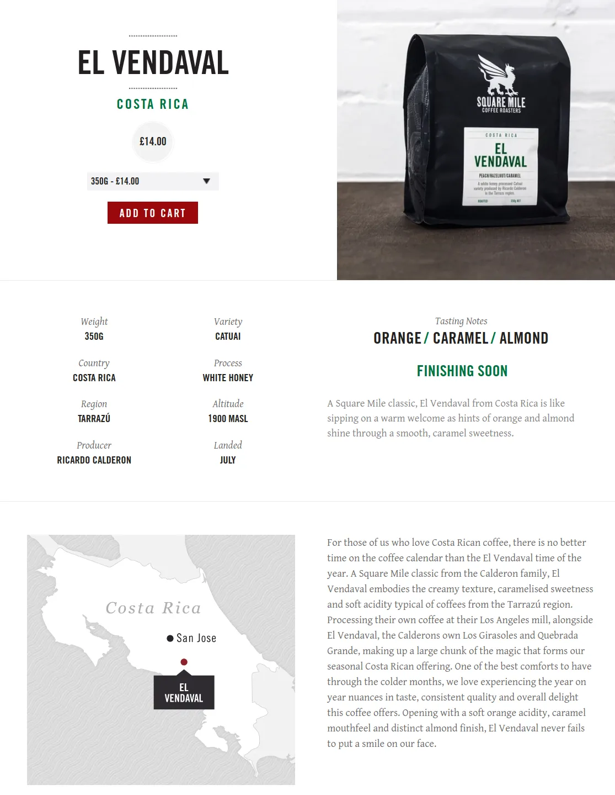
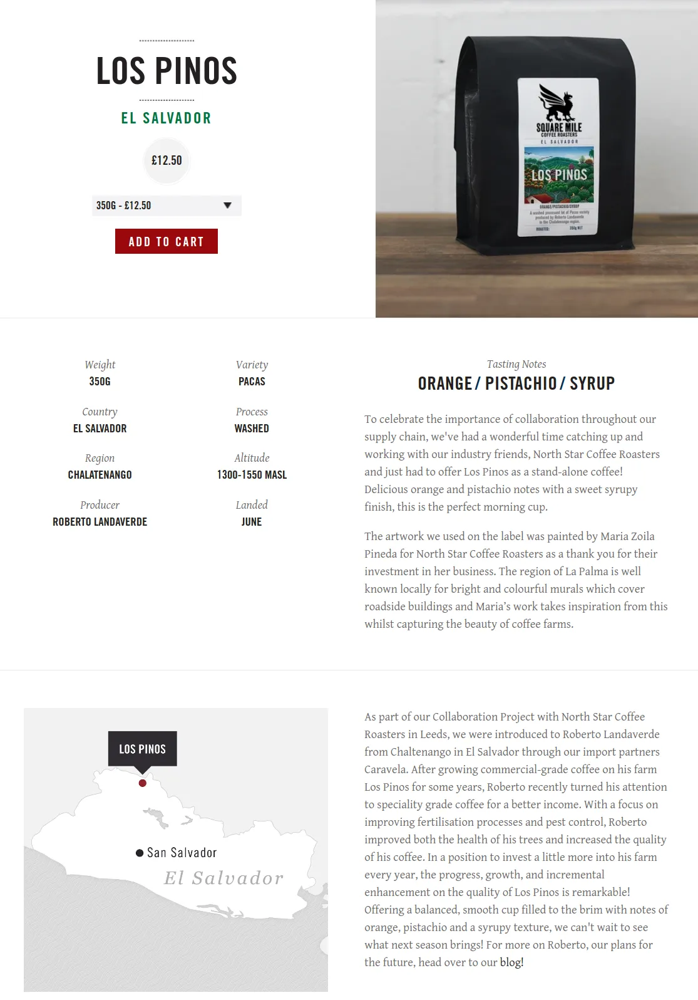
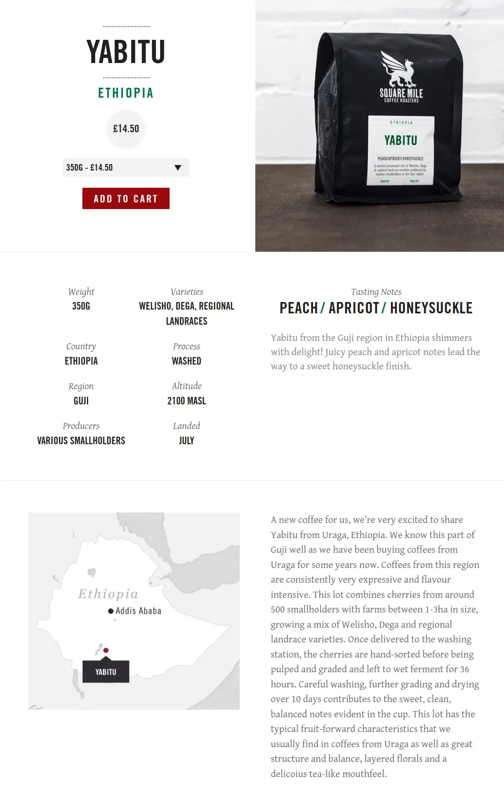

# Brewed Coffee Beans

| Name           | Roaster | Origin      | Roast Level | Process               | Tasting Notes                                |
| -------------- | ------- | ----------- | ----------- | --------------------- | -------------------------------------------- |
| Mensur Abahika | Ozone   | Ethiopia    | Omni        | Natural               | Blueberries, Cranberry, Jasmine              |
| Wa Choo        | Origin  | China       | Omni        | Natural               | Pink Grapefruit, Pomegranate, Dark Chocolate |
| Wa Choo        | Origin  | China       | Omni        | Washed                | Blackberry, Elderflower & Sugarcane          |
| San Antonio    | Origin  | El Salvador | Omni        | Black Honey           | Raspberry, Apricot & Molasses                |
| San Fermin     | Origin  | Colombia    | Omni        | Washes                | Orange Sherbet, Caramel, Berries             |
| Elvis          | Origin  | Peru        | Omni        | Extended Fermentation | Raspberry, Lemongrass & Brown Sugar          |
| Aqi Badu       | Origin  | China       | Omni        | Natural               | Pineapple, Persimmon & Dark Chocolate        |

## Elvis

The 36 hour fermentation creates crisp raspberry acidity alongside citrus complexity.

We started our journey in Peru two years ago with our local partner Falcon Specialty. Falcon only works with producers, who aren’t members of a cooperative, association or organisation. These producers are the most vulnerable since they don’t have access to training sessions or premiums for quality or certifications, and their income is totally dependent on the market price..

This coffee is produced by Elvis Tineo Rafael, a second-generation coffee producer in El Diamante. We met him on our last trip and shared coffee and lunch together, to discuss his process.

His coffee was washed and floated before being macerated in the cherry for 12 hours, which provides more sweetness to the coffee. The coffee was then dried under shade for 15 days. This process intensifies the acidity and transforms the final coffee to provide a crisp mouthfeel and sugary sweetness.

**FARM INFORMATION:**

Country: Peru
Method: Extended Fermentation
Producer: Elvis Tineo Rafael
Region: Jaen, Cajamarca
Varietal: Cataui
Elevation: 1,730 masl
Price to Producer: USD/LB: N/A

## San Fermin

San Fermin is what we call a ‘session coffee', something you can drink all day long.

San Fermin is a lot built from dozens of small producers in south Tolima. Etched out of the mountains, situated in some of the most remote locations each farm is only a few hectares. Farmers must cross rivers and trek through jungles before they can load dirt bikes and carts pulled by donkeys, to get the coffee to our partners at the local warehouse.

The producers of San Fermin are a key part of who we are, and we have two ongoing projects that celebrate that relationship. Our yearly producer competition recognises these truly exceptional lots. Additionally, we have committed to purchasing a drier with our local partners, Caravela. This will save the producers having to return the coffee all the way back to their farms if it still needs some further drying, saving them extra time and effort.

**FARM INFORMATION**

Country: Colombia
Method: Washed
Producer: 27 Producers
Region: Tolima
Varietal: Caturra
Elevation: 1,600 - 2,000 masl
Price to Producer:  N/A

## Banka

For cappuccino, the flavour is very balanced, it is not sour, not bitter, tastes perfect.

> Producer: Small-holder farmers from the villages of Banka Yi and Banka Er
> Processed at: Banka washing station managed by Yunnan Coffee Traders
>
> Region: Menglian Dai, Lahu and Va Autonomous County, Yunnan, China
>
> Altitude: 1350 masl
>
> Varietal: Catimor P3 & P4 Hybrid cultivars
> Process: Natural, fermented in cherry for 2 days then dried inside of a solar dryer on raised beds for roughly 20 days
>
> Importer: Indochina Coffee
>
> Cup profile: Jammy & thick body, dark cherries & maple syrup

{width="400"}

## Gui Ben

{width="400"}
{width="350"}

## CABALLERO #131

These beans have a very strong chili paste smell and flavour, it is too much for my taste.

{width="350"}

## El Vendaval

{width="350"}

## Los Pinos

{width="350"}

## Yabitu

{width="350"}

## Links to this note

[Index Coffee](index-coffee.md)
