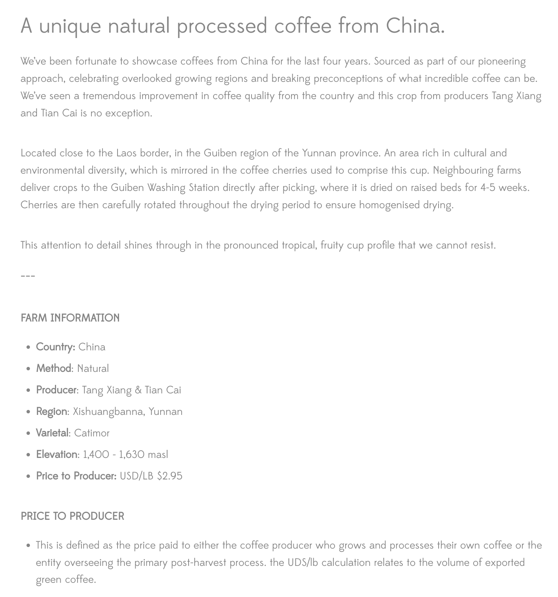
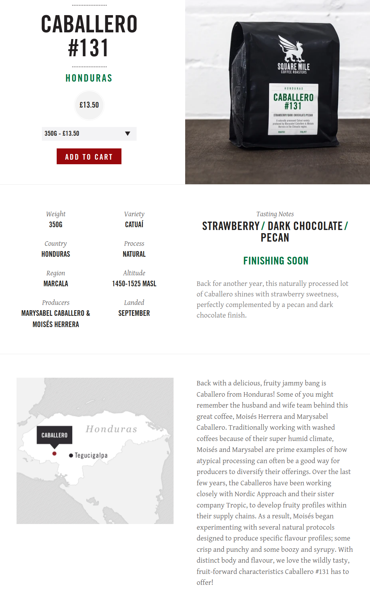
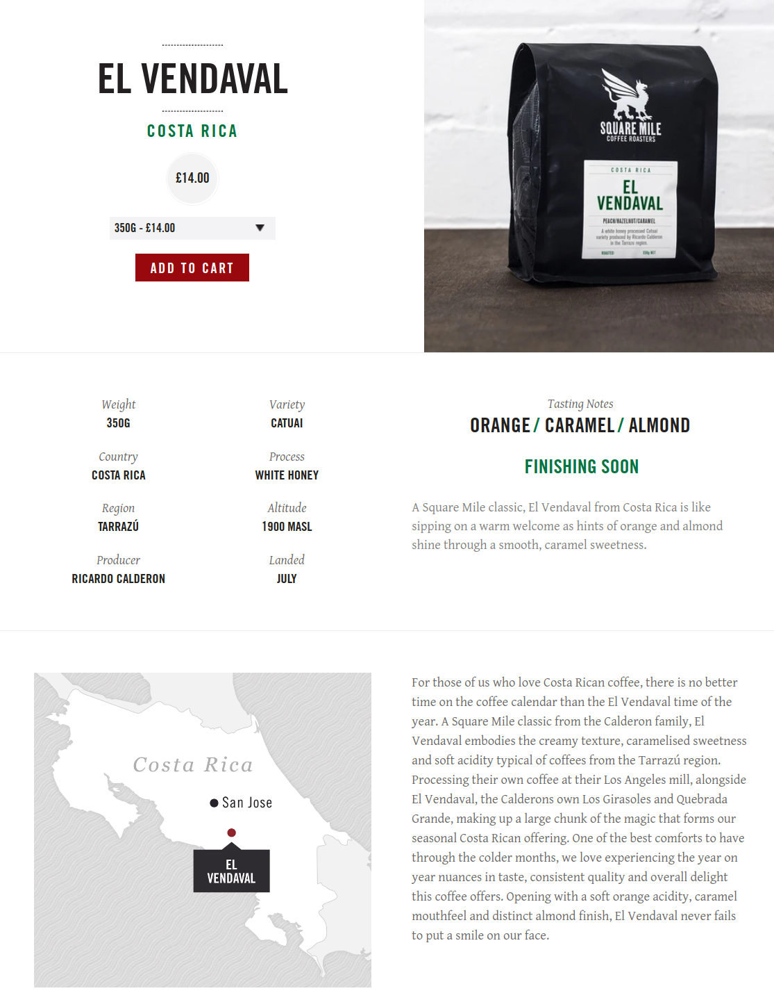
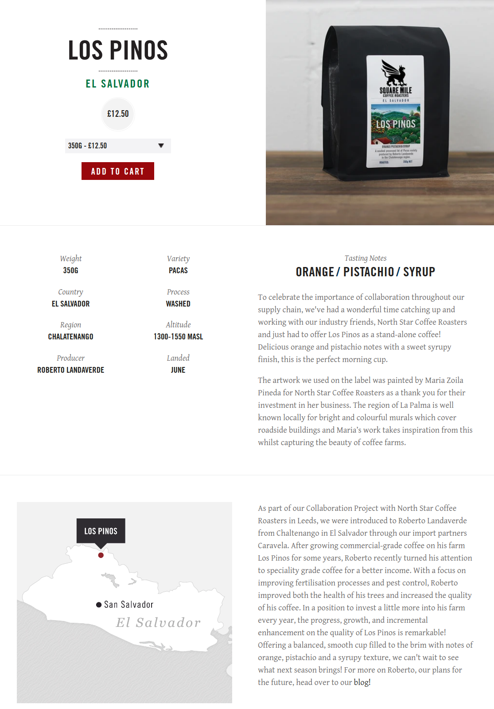

# Brewed Coffee Beans

| Name           | Roaster | Origin      | Roast Level | Process     | Tasting Notes                                |
| -------------- | ------- | ----------- | ----------- | ----------- | -------------------------------------------- |
| Mensur Abahika | Ozone   | Ethiopia    | Omni        | Natural     | Blueberries, Cranberry, Jasmine              |
| Wa Choo        | Origin  | China       | Omni        | Natural     | Pink Grapefruit, Pomegranate, Dark Chocolate |
| San Antonio    | Origin  | El Salvador | Omni        | Black Honey | Raspberry, Apricot & Molasses                |

## Banka

For cappuccino, the flavour is very balanced, it is not sour, not bitter, tastes perfect.

> Producer: Small-holder farmers from the villages of Banka Yi and Banka Er
> Processed at: Banka washing station managed by Yunnan Coffee Traders
>
> Region: Menglian Dai, Lahu and Va Autonomous County, Yunnan, China
>
> Altitude: 1350 masl
>
> Varietal: Catimor P3 & P4 Hybrid cultivars
> Process: Natural, fermented in cherry for 2 days then dried inside of a solar dryer on raised beds for roughly 20 days
>
> Importer: Indochina Coffee
>
> Cup profile: Jammy & thick body, dark cherries & maple syrup

{width="400"}

## Gui Ben

{width="400"}
{width="350"}

## CABALLERO #131

These beans have a very strong chili paste smell and flavour, it is too much for my taste.

{width="350"}

## El Vendaval

{width="350"}

## Los Pinos

{width="350"}

## Yabitu

{width="350"}

## Links to this note

[Index Coffee](index-coffee.md)
