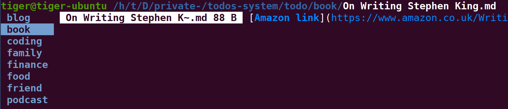

# TODOs System

This system is for long term TODOs, long term TODOs last from multiple days to months.

For short term TODOs, I use google Keep instead, short term TODOs last for 1 to 2 days.

## Pros and Cons of a personal TODO system

Pros:

- done in terminal, avoid change of context when switching to Jira Web UI
- avoid the need for internet connection
- can use markdown & Vim & terminal programs
- no need to learn Jira web interface
- version control

Cons:

- needs time to setup and maintain (but it is worth it because this can last for the rest of my life!)

## How to replace features in Jira?

**Prerequisite**

Dedicate a folder for this TODO system.

For example, `mkdir todos-system`.

**Ticket**

In jira, each ticket represents a task.

This feature is replaced by creating a markdown file, where the title is the filename, and description is content of file.

**Status**

In jira, status can be `todo`, `in progress`, `done` and an implicit status `deleted`.

I don't use `in progress` because I use Google Keep to keep track of short term task that I am doing.
So I only need to implement `todo`, `done` and `deleted`.

The implementation is to add a top level folder for each of the status.

For example 

```bash
$ ls ./todos-system/

todo/
done/
deleted/
```

*considered implementation*

I have considered deleting a ticket to indicate status `done` or `deleted` but because tickets are no longer in from the file system so I cannot grep for `done` or `deleted` tickets.

I have also considered adding prefix to filename, such as `done-`, to indicate the status of the ticket, but it requires cumbersome extra filtering, such as, `ls --ignore=done*`.

**Epics**

In jira, one can assign tickets to one and only one epic, this groups tickets to different topics.

This feature is implemented by using one folder to represent one epic, see example below for using three folders to implement of three epics `tech`, `podcast` and `blog`.


```bash
$ ls ./todos-system/todo/

tech/
podcast/
blog/
```

However, only status folder `todo` contains epic folder, other status folder stores tickets without any folder, this is to avoid the need for mirroring epic folders in all status folders, the consequence is that epic is lost when ticket is moved to `done` or `deleted`. Though I can still find it from git history.

```bash
$ ls ./todos-system/done/

foo.md # no epic folders such as `tech/`
```

**Ticket orders**

In jira, you can drag tickets up and down to indicate order or priority of tickets.

I haven't figure out a way to implement it yet. One idea is to change the last modified time by `touch` the ticket and then do `ls -t` to sort by last modified, however, this can only move ticket up but not in arbitrary order.

**Finally**

One benefit of this system is that everything can be done with basic file operations.

An example folder layout:

```
todos-system/
    todo/
        foo.md
    done/
        bar.md
    deleted/
        baz.md
```

## Use with Ranger

Ranger is a terminal file explorer with Vi keybindings.

I use it to preview the tickets!



## Cheat sheet

Assuming the current directory is `todo`


| Task                          | Command                     |
|-------------------------------|-----------------------------|
| create a new ticket           | `touch foo.md`              |
| add description               | `vim foo.md`                |
| see description of ticket     | `cat ticket.md`             |
| create a new epic             | `mkdir tech`                |
| move ticket to new epic       | `mv foo.md tech/`           |
| assign ticket to another epic | `mv tech/foo.md blog/`      |
| list all tickets              | `ls -R -1`                  |
| list tickets of specific epic | `ls -1 tech/`               |
| delete a ticket               | `mv tech/foo.md ../deleted` |
| assign a ticket to done       | `mv tech/foo.md ../done`    |
| filter out done tickets       | unnecessary                 |


----

Related links

See [todo.txt TODO system](https://github.com/todotxt/todo.txt) for a more minimal way of setting up TODO system, it suggests prefixing `(A), (B), (C)` to indicate priority, maybe I can use this too.
